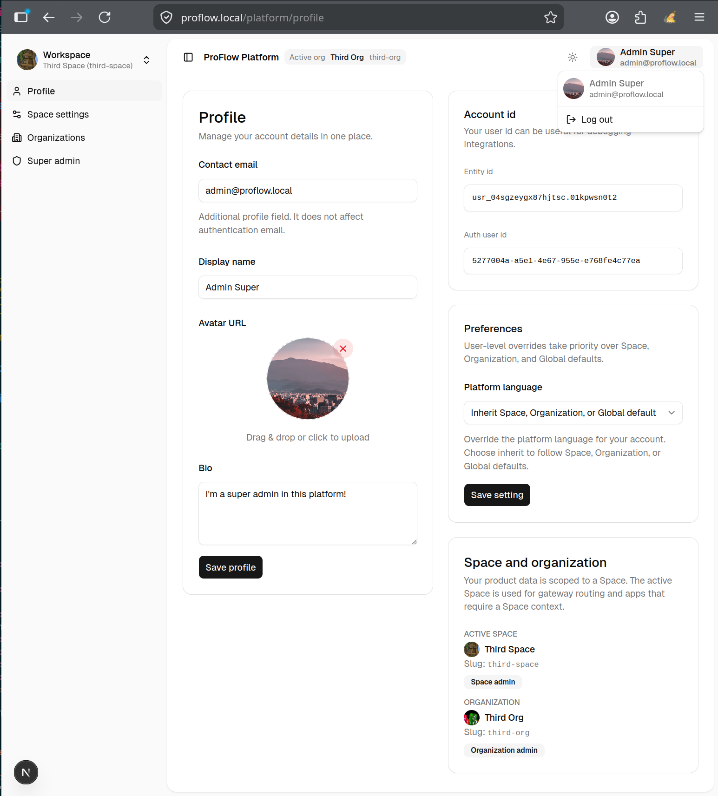

# ProFlow

A self-hosted platform for running content across spaces and orgs. ProFlow brings together a Next.js gateway shell (`apps/web`), a platform app (`apps/platform`), a Payload CMS authoring app (`apps/author`), and a self-hosted Supabase stack for identity, RBAC, and persistence.



Profile screen from the platform app inside the gateway-mounted workspace shell.

## Architecture overview

| Layer | What it does |
|---|---|
| `apps/web` | Gateway shell that routes requests to platform and author |
| `apps/platform` | Platform app for orgs, spaces, memberships, invites, and RBAC |
| `apps/author` | Payload CMS app for space-scoped content authoring |
| `services/notifications` | Bun worker for transactional email |
| `NATS / JetStream` | Event backbone for identity fan-out and async jobs |
| `infra/dev` | Local dev stack: nginx, MongoDB, Maildev, NATS, and self-hosted Supabase |
| `packages/db` | Generated Supabase TypeScript types |
| `packages/rbac` | Permission keys and typed RBAC helpers |
| `packages/domain-events` | Zod-validated event contracts |
| `packages/ui` | Shared shadcn/ui component library |
| `packages/i18n-catalogs` | Shared i18n JSON catalogs |
| `supabase/migrations/` | Postgres schema and migration history |

**Identity source of truth:** Platform owns user lifecycle. Author and other shells consume mirrored read-side data. See [docs/data-ownership-matrix.md](docs/data-ownership-matrix.md) and [docs/identity-domain-boundary.md](docs/identity-domain-boundary.md).

## Prerequisites

- [Bun](https://bun.sh) ≥ 1.1
- [Docker](https://docs.docker.com/get-docker/) + Compose v2
- [Supabase CLI](https://supabase.com/docs/guides/cli) (or `bunx supabase`)
- `mkcert` (recommended for trusted local TLS) or `openssl`

## Run it locally

### 1. Clone the repo and install dependencies

```bash
git clone <repo-url> proflow
cd proflow
bun install
```

### 2. Add local hostnames

```
127.0.0.1 proflow.local api.proflow.local
```

### 3. Create TLS certificates

Using **mkcert** is the easiest option if you want browser-trusted local HTTPS:

```bash
mkcert -install
mkcert proflow.local api.proflow.local
cp proflow.local+1.pem infra/dev/nginx/ssl/proflow.local.crt
cp proflow.local+1-key.pem infra/dev/nginx/ssl/proflow.local.key
```

Or use a self-signed certificate if you just want to get the stack running quickly:

```bash
make dev-nginx-ssl
```

### 4. Copy environment files

Copy each example and fill in the required values:

```bash
cp infra/dev/.env.example            infra/dev/.env
cp infra/dev/supabase/.env.example   infra/dev/supabase/.env
cp apps/web/.env.example             apps/web/.env
cp apps/platform/.env.example        apps/platform/.env
cp apps/author/.env.example          apps/author/.env
cp tests/e2e/.env.example            tests/e2e/.env
```

Before the first start, make sure these values are set in `infra/dev/supabase/.env`:

- `POSTGRES_PASSWORD` — Postgres superuser password
- `JWT_SECRET` — HS256 secret (≥ 32 chars)
- `ANON_KEY` / `SERVICE_ROLE_KEY` — HS256-signed JWTs
- `DASHBOARD_USERNAME` / `DASHBOARD_PASSWORD` — Supabase Studio credentials

The comments in `infra/dev/supabase/.env.example` include generation hints.

### 5. Start the local infrastructure stack

For a first run, use the clean recreate path so Postgres starts fresh and migrations are applied automatically:

```bash
make stack-recreate-clean RECREATE_YES=1
```

After that, the normal startup path is enough:

```bash
make stack-up
```

This brings up nginx, MongoDB, Maildev, NATS, and the full self-hosted Supabase stack under the `proflow` Docker Compose project.

### 6. Apply database migrations

If you skipped the clean recreate step, or you have new migrations to apply, run:

```bash
make db-push
```

This applies Supabase CLI migrations to the local Postgres instance and then syncs the identity fan-out secret (`make db-sync-identity-secret`). Without it, Postgres triggers will not call `identity_lifecycle_fanout` and Author will not receive identity events.

### 7. Build shared packages

```bash
bun run build:libs
```

### 8. Start the apps

```bash
bun run dev
```

This starts all apps through Turbo. Everything is served through the nginx gateway:

| URL | App |
|---|---|
| `https://proflow.local` | Gateway shell (`apps/web`) |
| `https://proflow.local/platform` | Platform admin (`apps/platform`) |
| `https://proflow.local/author` | Payload CMS authoring (`apps/author`) |
| `https://api.proflow.local` | Supabase API (Kong) |
| `http://localhost:8082` | Supabase Studio |
| `http://localhost:9090` | Maildev — captured dev email |

> `bun run dev` (Turbo) also starts `services/notifications`, which the styled-email
> pipeline below needs. `bun run dev:apps` starts only the shell apps (no notifications).

### 9. Create the first platform super-admin

Set `PLATFORM_INITIAL_SUPER_ADMIN_EMAIL` in `apps/platform/.env` to the email you plan to sign in with. On the first sign-in, if no super-admin grant exists yet, the server seals the bootstrap path and grants `platform.admin.override` once.

### 10. Styled transactional email (GoTrue send-email hook)

By default GoTrue sends its **plain built-in** auth emails. The styled ProFlow
templates (`@workspace/notifications`, React Email) are delivered through the
**send-email hook**: GoTrue → Edge `email_sender` → `services/notifications` →
SMTP → Maildev. It is **off by default** because it needs a shared secret and the
notifications service running. To enable it:

1. In `infra/dev/supabase/.env` set (generate the secret/token):

   ```bash
   GOTRUE_HOOK_SEND_EMAIL_ENABLED=true
   GOTRUE_HOOK_SEND_EMAIL_URI=https://kong:8443/functions/v1/email_sender
   GOTRUE_HOOK_SEND_EMAIL_SECRETS=$(openssl rand -base64 32 | tr -d '\n' | sed 's/^/v1,whsec_/')
   NOTIFICATIONS_INTERNAL_TOKEN=$(openssl rand -hex 24)
   NOTIFICATIONS_SERVICE_URL=http://host.docker.internal:3010
   ```

2. Create `services/notifications/.env` (`cp services/notifications/.env.examples services/notifications/.env`)
   and set SMTP at Maildev (`SMTP_HOST=127.0.0.1`, `SMTP_PORT=2500`), the **same**
   `NOTIFICATIONS_INTERNAL_TOKEN`, and `SUPABASE_SERVICE_ROLE_KEY`.

3. Recreate the affected containers so they pick up the env, then (re)start dev:

   ```bash
   make stack-up                     # recreates auth + functions with the new env
   bun run dev                       # includes services/notifications
   ```

Sign up a user and the confirmation email lands styled in Maildev
(`http://localhost:9090`). Without this, you still get a working — just plain — email.

## Useful commands

```bash
# Generate TypeScript types from the local Postgres schema
make db-types

# Create a new migration file
make db-new NAME=add_my_table

# Run Vitest unit tests (alias: `bun run test`)
bun run test:vitest

# Run full E2E suite (non-interactive)
bun run test:e2e:full:ni

# Run smoke E2E suite only
bun run test:e2e:smoke:ni

# Lint, typecheck, format
bun run check
```

> **Do not run `bun test`.** Bun's native test runner scans every `*.test.ts` /
> `*.spec.ts` and tries to run them itself — but our unit tests are **Vitest** and our
> e2e are **Playwright**, neither of which Bun's runner can execute, so it reports a wall
> of false failures. Always use the scripts above (`bun run test:vitest` /
> `bun run test:e2e*`), which invoke the correct runners via Turbo.

## Shared packages

Most reusable pieces live in `packages/*`. For example:

```bash
# Add a shadcn/ui component to the shared UI package
bunx shadcn@latest add button -c apps/web

# Import from the shared UI package
import { Button } from "@workspace/ui/components/button";
```

## Key docs

- [docs/data-ownership-matrix.md](docs/data-ownership-matrix.md) — who writes what
- [docs/identity-domain-boundary.md](docs/identity-domain-boundary.md) — identity vs domain operations
- [docs/domain-application-infrastructure-contexts.md](docs/domain-application-infrastructure-contexts.md) — analysis order for features
- [docs/rbac/README.md](docs/rbac/README.md) — RBAC model
- [infra/dev/README.md](infra/dev/README.md) — infra stack details, Edge Function logs, force-clean reset
- [infra/dev/nginx/README.md](infra/dev/nginx/README.md) — nginx config, TLS, troubleshooting

## What is next

These are the nearest open items pulled from [docs/cross-functional-checklist.md](docs/cross-functional-checklist.md).

### 1. Space isolation alignment (section 2)

Finish aligning space isolation across RBAC, domain resources, and storage conventions so everything consistently uses the same `space_id` boundary.

### 2. Materials, uploads, and object storage (section 8)

Ship the first complete pass of file handling on Supabase Storage: upload, read, delete, policies, and reusable conventions for product surfaces.

### 3. Audit log (security-sensitive and admin actions) (section 9)

Add an append-only audit trail for privileged actions, with consistent instrumentation and operator-facing read access.

### 4. Observability and operations (phase 2)

Expand the operational baseline with structured context, service metrics and tracing, plus readiness and liveness checks across apps and workers.

### 5. Abuse, limits, and lifecycle controls (phase 2/3)

Add the cross-cutting protections and lifecycle controls that still need to land: rate limiting, plus space or organization export/delete support.

